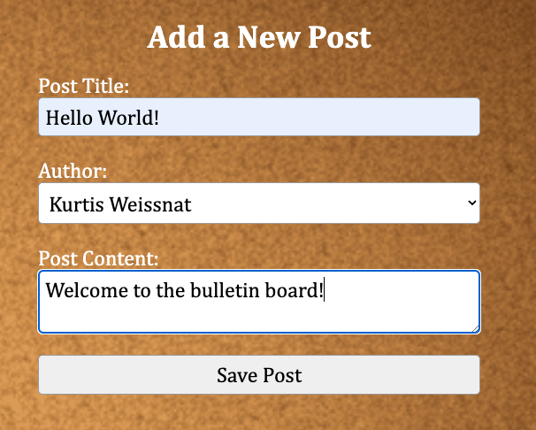

<h1>Bob's Bulletin Board</h1>

A bulletin board app that uses JSONPlaceholder API to pre-populate the board with posts containing placeholder lorem ipsum text. Uses Date-fns to display the timestamp of each post.  

Users can add new posts to the board containing any message they want to share, and can add reactions to any post using different emojis.  

**To add a post:** Enter a title, chose an author, and enter the message you want to post. Then click "Save Post" to add it to the bulletin board.  

**To add a reaction to a post:** Simply click on the emoji you want to react with.  
  
**Technologies Used:** React, Redux Toolkit, JSONPlaceholder API, Axios, Date-fns, CSS  
  
**Dependencies:** react, react-redux, redux.js/toolkit, axios, date-fns  

How to run it: npm start  

Click **[here](https://rck-bulletin-board.netlify.app/)** to view the live site.  

<h2>Screenshots</h2>  
<strong>Add a new post:</strong>
   
 

 
 
<strong>New post saved with live reactions:</strong>
 
 

